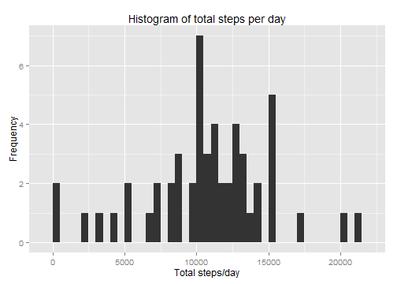
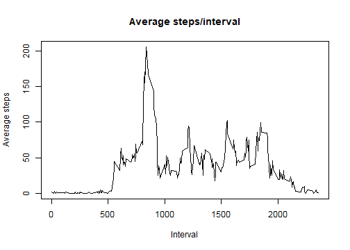
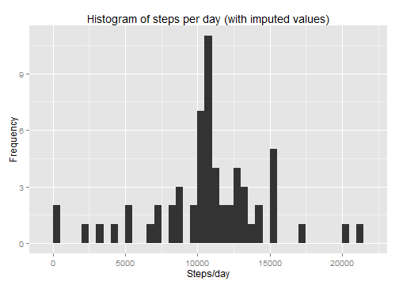
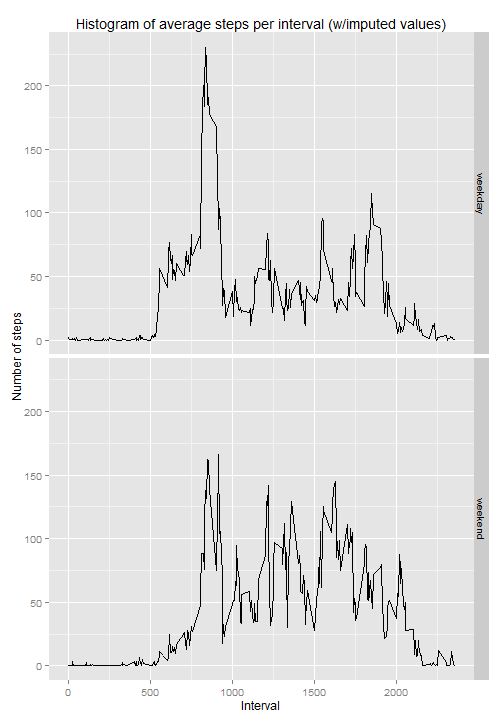

## Set up
### Set the working directory and read in the data


```r
## Set the working directory
setwd("~\\JHU Data Science\\Reproducible Research\\Project 1")
getwd()
```

```
## [1] "C:/Users/mark/Documents/JHU Data Science/Reproducible Research/Project 1"
```

```r
## Read in the data
ACT <- read.csv("activity.csv")
str(ACT)
```

```
## 'data.frame':	17568 obs. of  3 variables:
##  $ steps   : int  NA NA NA NA NA NA NA NA NA NA ...
##  $ date    : Factor w/ 61 levels "2012-10-01","2012-10-02",..: 1 1 1 1 1 1 1 1 1 1 ...
##  $ interval: int  0 5 10 15 20 25 30 35 40 45 ...
```
  
  
## Steps per day
### Create a data frame of the total number of step/day


```r
## Remove the NAs and compute the mean/day
ACTX <- ACT[!is.na(ACT$steps),]
SPD <- data.frame(as.numeric(tapply(ACTX$steps, ACTX$date, sum)))
names(SPD) <- "STEPX"
```

### Histogram of step/day


```r
## Create a histogram
q <- ggplot(SPD, aes(STEPX))
p <- q + geom_histogram(binwidth=500) +
     labs(x = "Total steps/day") +
     labs(y = "Frequency") +
     labs(title = "Histogram of total steps per day")
print(p)
```

 

```r
#hist(SPD$STEPX, breaks=20, main="Histogram of steps/day", xlab="Steps/day")
#qplot(data=SPD, x=STEPX, binwidth=2)
```

### Mean and median step/day


```r
## Compute mean
MN <- format(mean(SPD$STEPX, na.rm=TRUE), digits=6)

## Compute median
MED <- format(median(SPD$STEPX, na.rm=TRUE), digits=6)
```

Total steps/day  
- Mean = 10766.2  
- Median = 10765
  
    
## Steps per interval
### Create a data frame with the average number of step in each interval  
### Plot the data


```r
SPDD <- data.frame(as.integer(tapply(ACTX$interval, ACTX$interval, mean)),
                   as.numeric(tapply(ACTX$steps, ACTX$interval, mean)))
names(SPDD) <- c("interval", "stepx")
with(SPDD, plot(interval, stepx, type="l", 
                main="Average steps/interval", 
                xlab="Interval", 
                ylab="Average steps"))
```

 

### Interval with the maximum steps  

```r
SPDDD <- SPDD[order(SPDD$stepx, decreasing=TRUE), ]
```

The interval with the maximum steps is 835. On average, 206.1698113 steps were taken in that interval.


## Imputing missing values
### Count the number of rows with NA values.

```r
nax <- summary(ACT$steps)[7]
```

There are 2304 rows with missing data.

### Impute the missing rows  
### Use the average of the same interval on days with non-missing values

```r
ACT_IMP <- ACT
ACT_IMP$steps <- as.numeric(ACT_IMP$steps)

for(i in 1:17568) {
   if(is.na(ACT_IMP[i,1])) ACT_IMP[i,1] <- SPDD$stepx[SPDD$interval==ACT_IMP[i,3]]
   }
```
 
### Histogram of step/day using imputed data


```r
## Compute steps/day
SPD_IMP <- ACT_IMP %>% group_by(date) %>% summarize(totstep=sum(steps))

## Create a histogram
q <- ggplot(SPD_IMP, aes(totstep))
p <- q + geom_histogram(binwidth=500) +
     labs(x = "Steps/day") +
     labs(y = "Frequency") +
     labs(title = "Histogram of steps per day (with imputed values)")
print(p)
```

 
 
### Mean and median step/day using imputed data


```r
## Compute mean
MN <- format(mean(SPD_IMP$totstep, na.rm=TRUE), digits=6)

## Compute median
MED <- format(median(SPD_IMP$totstep, na.rm=TRUE), digits=6)
```

Steps/day using imputed values
- Mean = 10766.2  
- Median = 10766.2  
The mean is the same with or without imputation.
The median is very close to the values without imputation.
  
  
## Comparing weekdays and weekends
### Create a factor variable for weekdays and weekends

```r
ACT_IMP <- mutate(ACT_IMP, WKDY = weekdays(as.POSIXct(date, format='%Y-%m-%d')))
ACT_IMP <- mutate(ACT_IMP, FX = ifelse(ACT_IMP$WKDY %in% c("Saturday","Sunday"), "weekend", "weekday"))
```

### Plot the steps/interval on weekday and weekends

```r
TMP_IMP <- ACT_IMP %>% group_by(interval, FX) %>% summarize(avgstep=mean(steps))

q <- ggplot(TMP_IMP, aes(interval, avgstep))
p <- q + geom_line() +
     facet_grid(FX ~ .) +
     labs(x = "Interval") +
     labs(y = "Number of steps") +
     labs(title = "Histogram of average steps per interval (w/imputed values)")
print(p)
```

 


